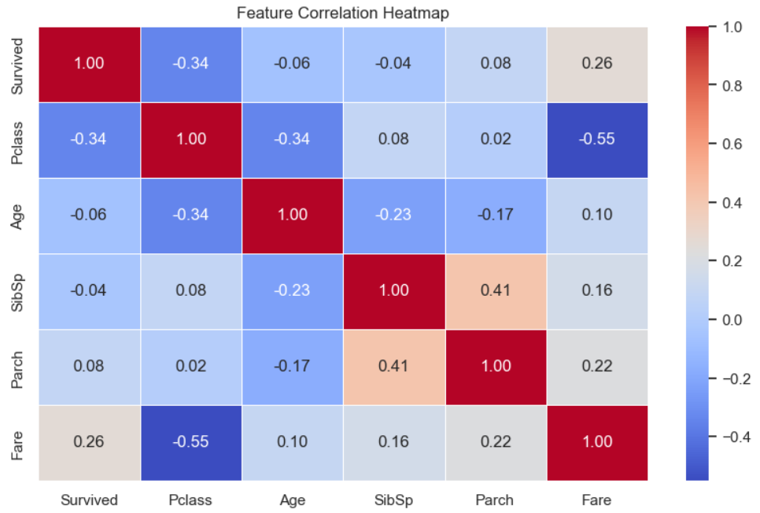

# TASK 2 - Exploratory Data Analysis (EDA) on Titanic Dataset

This project performs data cleaning and exploratory data analysis (EDA) on the Titanic dataset. It aims to identify variable relationships, trends, and missing data issues that could influence survival predictions.

---

## Tech Stack & Libraries

- Python 3.x  
- Jupyter Notebook  
- pandas  
- numpy  
- seaborn  
- matplotlib  

---

## Files Used
- Source - https://www.kaggle.com/c/titanic/data
- `train.csv`: Dataset containing Titanic passenger information  
- Description - Includes attributes like `Pclass`, `Sex`, `Age`, `Fare`, and `Embarked`. The target variable is `Survived`.

---

## Visualization Preview- One of the plots

> *Note: The notebook contains 11 different visualizations. However, only the correlation heatmap is included below for README brevity.*


---

## Insights

- Gender and class (`Pclass`) were strong predictors of survival.
- Female passengers and those in higher classes had notably higher survival rates.
- Visualizations like bar plots, histograms, and heatmaps helped uncover correlations and distribution trends.

---

## How to Run

1. Clone this repository or download the notebook and dataset.
2. Ensure all required libraries are installed:

   ```bash
   pip install pandas matplotlib seaborn numpy
